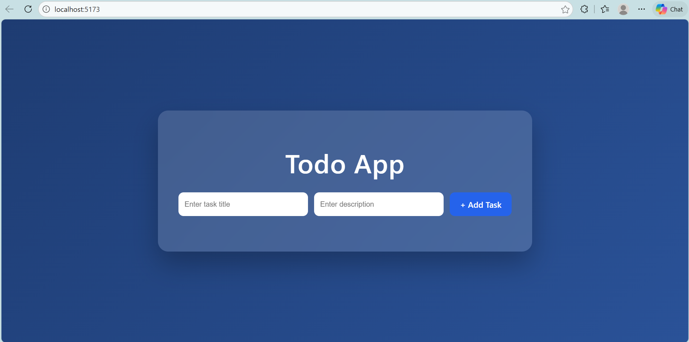
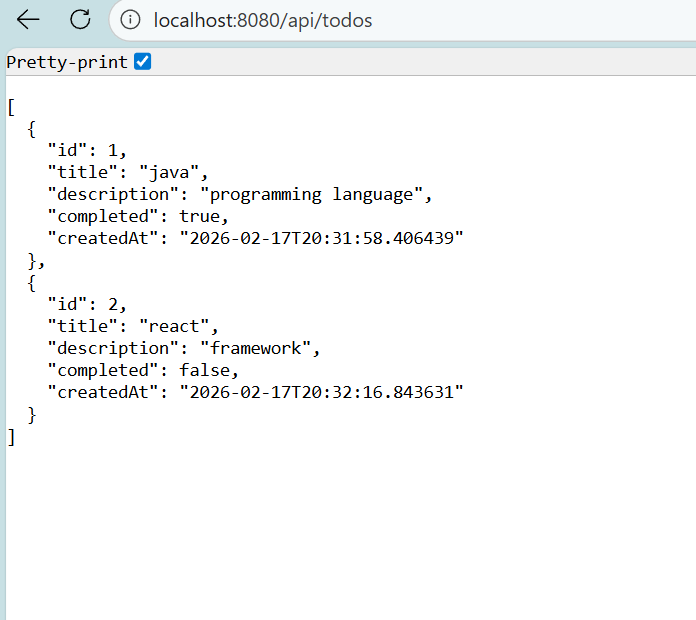
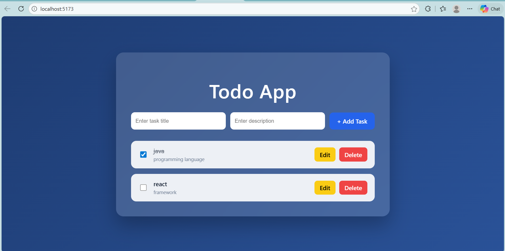

## 🚀 Fullstack Todo Application

A modern full-stack Todo Application built using Spring Boot (Backend) and React.js (Frontend).
This application allows users to create, update, delete, and mark tasks as completed with a clean and professional UI.

## 📌 Features

- ✅ Add new tasks with title and description  
- ✅ Edit existing tasks  
- ✅ Delete tasks  
- ✅ Mark tasks as Completed / Pending (Checkbox)  
- ✅ Strike-through effect for completed tasks  
- ✅ Responsive & modern UI design  
- ✅ RESTful API integration  
- ✅ Real-time UI updates  


## 🛠️ Tech Stack
🔹 Frontend

React.js (Vite)

Axios

JavaScript (ES6+)

CSS (Inline modern styling)

🔹 Backend

Spring Boot

Spring Data JPA

Hibernate

REST APIs

MySQL Database


## 📁 Project Structure

```
Fullstack-Todo-App
│
├── backend
│   ├── controller
│   ├── service
│   ├── repository
│   ├── model
│   └── DemoApplication.java
│
├── frontend
│   ├── src
│   │   ├── App.jsx
│   │   └── main.jsx
│   └── package.json
│
└── README.md
```

## ⚙️ How It Works

User enters task title & description.

React sends request using Axios.

Spring Boot REST API handles request.

Data is stored in MySQL database.

UI automatically refreshes.

## 📷 Application Screenshots

### 🖥 Frontend UI


### ⚙ Backend API


### 📋 Todo App



## 🧑‍💻 API Endpoints
Method	Endpoint	Description
GET	/api/todos	Get all todos
POST	/api/todos	Create new todo
PUT	/api/todos/{id}	Update todo
DELETE	/api/todos/{id}	Delete todo
## 🗄️ Database Structure
Todo Table
Column	Type
id	Long
title	String
description	String
completed	Boolean
createdAt	LocalDateTime
## ▶️ How to Run the Project
🔹 Backend
cd backend
mvn spring-boot:run


Server runs at:

(http://localhost:8080/api/todos)

🔹 Frontend
cd frontend
npm install
npm run dev


Runs at:

http://localhost:5173

## 🎯 Key Learning Outcomes

Built complete RESTful APIs using Spring Boot

Implemented CRUD operations

Integrated frontend with backend using Axios

Managed state using React Hooks

Designed professional UI

Implemented checkbox state sync with database

## 🌟 Future Enhancements

User Authentication (Login / Signup)

Dark Mode toggle

Task filtering (All / Completed / Pending)

Pagination

Deployment (Render / Railway / Vercel)

## 👨‍💻 Developed By
Teja Sri Gorle
